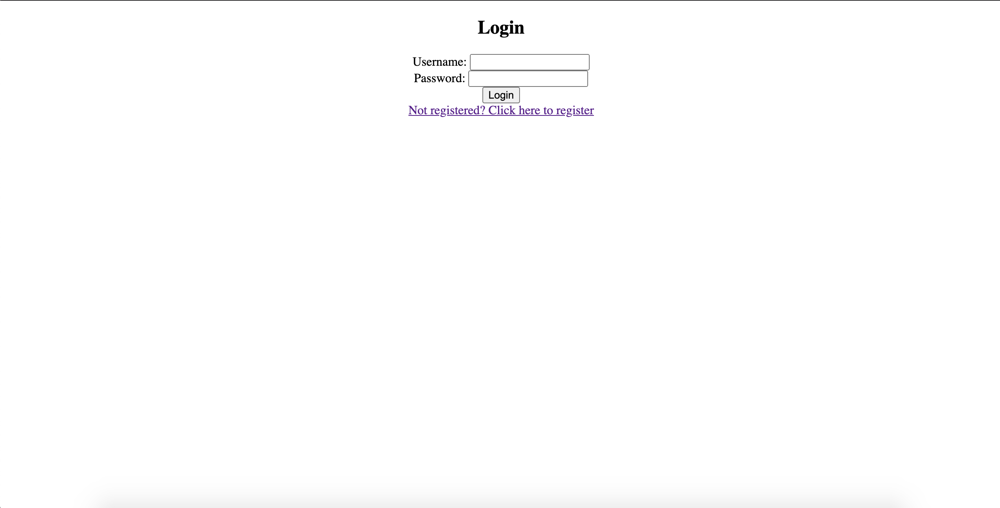
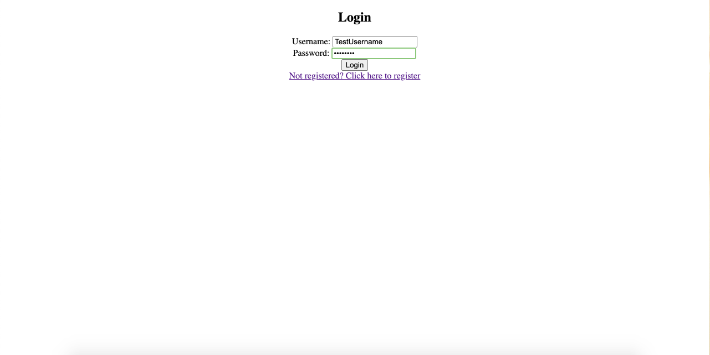
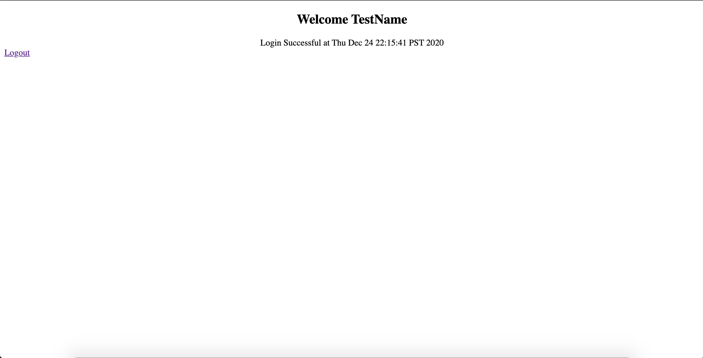
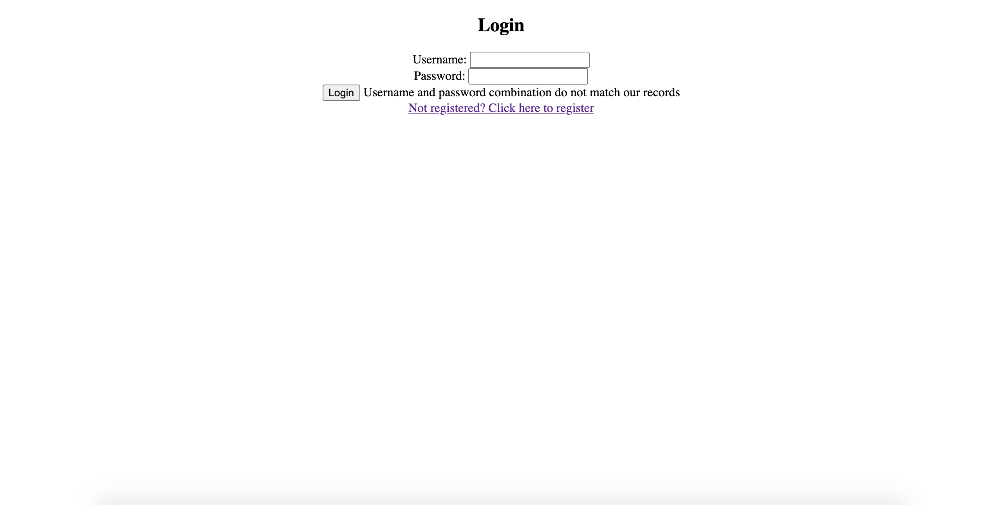
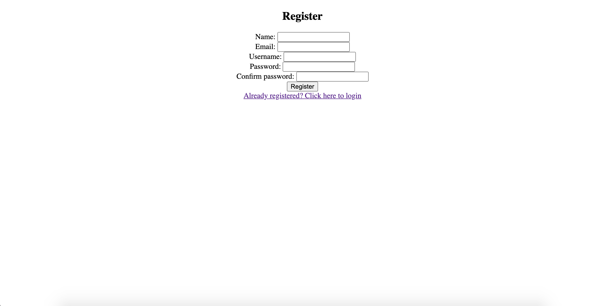
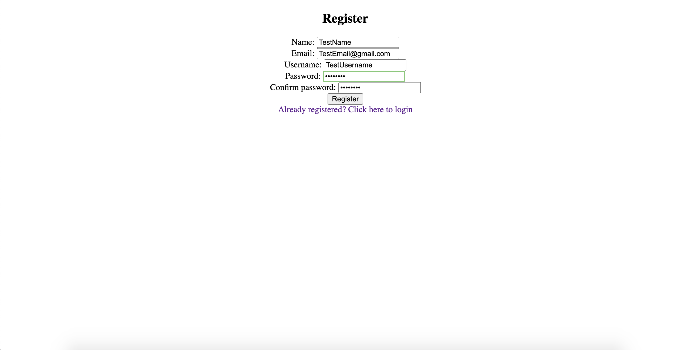
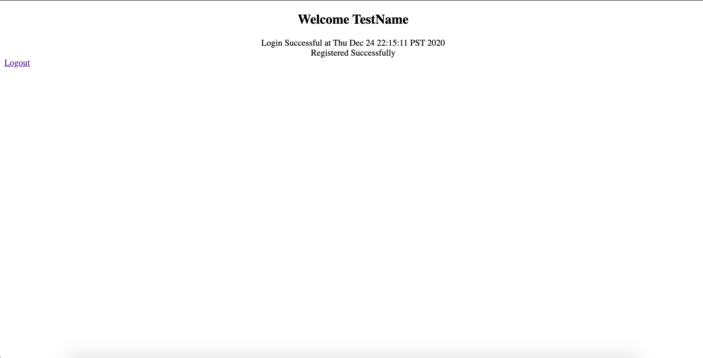
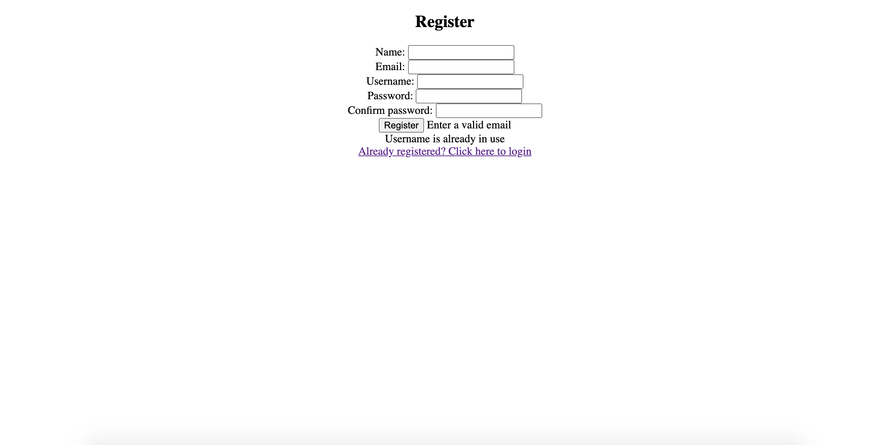

# Phase 2 Project

This program is a servlet-based web application that displays a registration and login form which on success redirects the user to a welcome page...

## Features

	- Basic registration and login page
	- Verifies user registration and login input
	- On registration success creates user account in database and redirects user to welcome page
	- On login success redirects user to welcome page
	- Welcome page displays login date and logout button

## Installation

	- Clone and pull source code from provided github repository
	- Compile source code with Java Compiler
	- Run with Apache Tomcat server

## Code

	https://github.com/nicholas-auyeung/Phase-2-Project

## Flow

1. Start by creating a 'Dynamic Web Project' in Eclipse

2. Import appropriate hibernate and H2 database jar files into library sub directory

3. Create 3 packages, 'com.entity', 'com.servlet', 'com.utility'

4. Create 'User' class inside 'com.entity' package

5. Create 'LoginController', 'RegisterController', and 'RegisterInsert' servlets inside 'com.servlet' package

6. Create 'HibernateUtility' class inside 'com.utility'

7. Create hibernate.cfg.xml

8. Configure hibernate.cfg.xml for update, xml mapping, and database connection settings

9. Define 'User' class with appropriate attributes and hibernate entity,id mapping

10. Define 'HibernateUtility' class

11. Create 'register' jsp page

12. Create 'login' jsp page

13. Create 'welcome' jsp page

14. Inside 'register' implement working form and set action to 'RegisterController'

15. Add error messages

16. Add hyperlink to redirect to 'login' jsp page

17. Define 'RegisterController' servlet

18. Inside 'RegisterController' start http session and check for all possible input errors

19. If input errors exist, redirect back to 'register' jsp page with error messages

20. If no input errors exist, create a User object with user input and set the object into the current http session

21. Forward input data to 'RegisterInsert' servlet

22. Define 'RegisterInsert' servlet

23. Inside 'RegisterInsert' obtain current http session and set up hibernate session and transaction

24. Retrieve the user object saved in the http session and save it into hibernate session and commit the transaction.

25. If success redirect to 'welcome' jsp page

26. Inside 'welcome' display appropriate registration success message and login date

28. Implement logout button redirecting to 'login' jsp page

29. Inside 'login' implement working form and set action to 'LoginController'

30. Add error messages

31. Add hyperlink to redirect to 'register' jsp page

32. Define 'LoginController' servlet

33. Inside 'LoginController' start http session and set up hibernate session

34. Check for all possible input errors

34. If input errors exist, redirect back to 'login' jsp page with error messages

35. If no input errors exist, compare username and password to existing accounts in database

37. If exists redirect to 'welcome' jsp page

## Usage

	Once run, the webpage will display a form asking for login credentials

User inputs valid login credentials

	User will be redirected to a welcome page displaying name, login date, and logout button

User inputs invalid login credentials
	
	User will be prompt with error message(s)

User clicks registration hyperlink

	User will be redirected to registration page displaying a form asking for registration information

User inputs valid registration information

	User will be redirected to a welcome page displaying name, login date, logout button, and registration success message

User inputs invalid registration information
	
	User will be prompt with error message(s)
